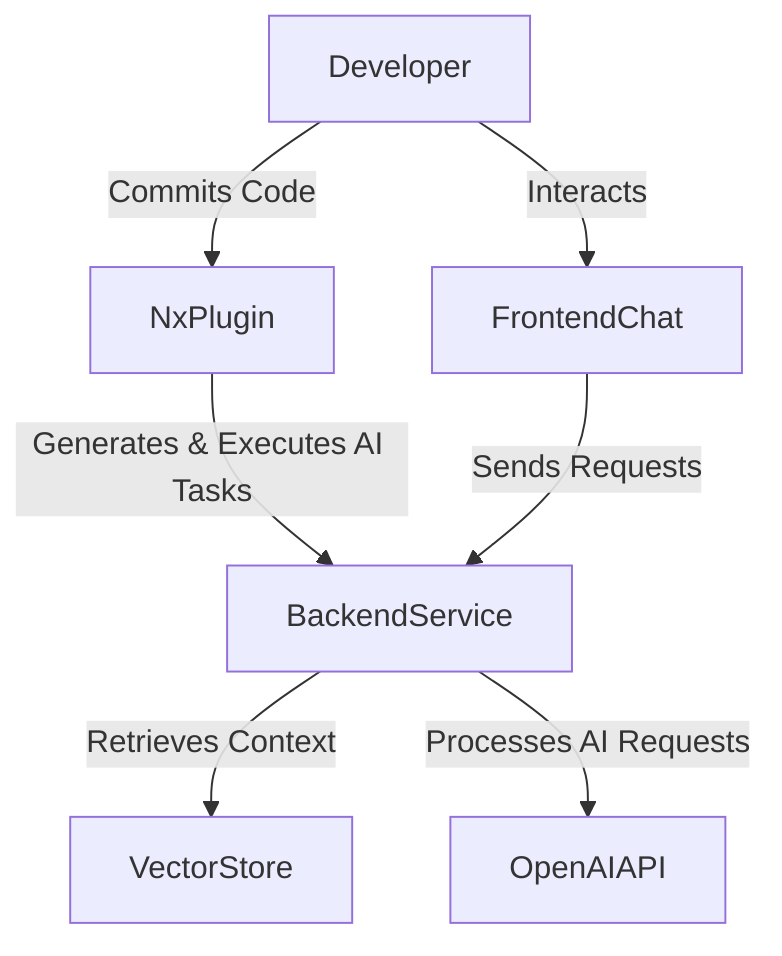
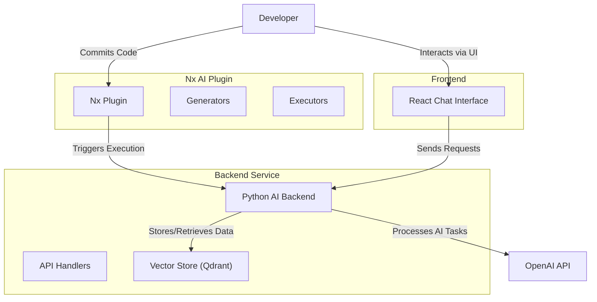
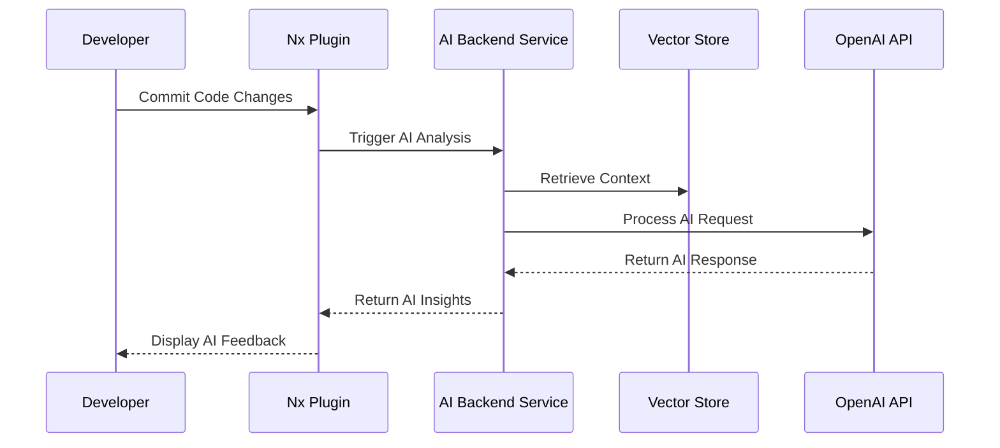

# NX AI Plugin Documentation

Welcome to the **NX AI Plugin**—a next-generation solution for automating code quality, enforcing architectural standards, and enhancing developer productivity within your Nx monorepo. This plugin enables seamless integration of AI-powered agents into your development workflow, improving efficiency and ensuring adherence to best practices.

## Key Features

### **1. Create and Manage AI Agents**
Easily define, configure, and deploy specialized AI agents that enforce coding rules, suggest improvements, and help maintain consistency across your codebase.

### **2. Context-Aware Vector Store**
Integrate a vector store to enable dynamic, memory-efficient interactions. Agents access deep contextual insights, allowing them to provide more accurate recommendations based on project history and structure.

### **3. AI-Powered Code Reviews**
Automate and streamline the code review process with AI-generated feedback, improving code readability, maintainability, and adherence to coding standards.

### **4. Streamlined Configuration & Credential Management**
Use built-in generators to quickly set up configurations, manage credentials securely, and update agent settings with ease.

By leveraging **multiple AI agents** and **vector-based retrieval**, the NX AI Plugin transforms your monorepo into a **self-improving development ecosystem**, helping teams optimize workflows, enforce standards, and improve overall code quality.

---

## 📚 Table of Contents

- [Introduction](#introduction)
- [Overview](#overview)
- [Getting Started](getting-started.md)
- [Generators](generators.md)
- [Executors](executors.md)
- [Usage Examples](usage-examples.md)
- [Architecture](#architecture)
- [Contributing](#contributing)
- [FAQ](#faq)

---

## 🚀 Introduction

### Why Use NX AI Plugin?

Managing large-scale monorepos presents challenges in maintaining code quality, enforcing architecture rules, and ensuring a scalable development workflow. **NX AI Plugin** addresses these challenges with AI-driven automation, integrating intelligent agents that enhance software development efficiency.

### **Benefits:**

- **Proactive Code Quality Management** – Identify and fix issues before they cause technical debt.
- **Accelerated Development Workflows** – Automate repetitive review tasks, allowing developers to focus on core features.
- **Standardized Code Practices** – Enforce best practices and ensure consistency across all projects.
- **Scalable & Adaptive** – Customize AI agent configurations as your monorepo evolves.

---

## 🔍 Overview

The **NX AI Plugin** introduces a modular AI-powered framework for Nx monorepos. It enables **dynamic AI code reviews, agent-driven best practices enforcement, and seamless configuration management.**

### **Key Components:**

#### 1️⃣ **Python Backend Service**
- Hosts the AI models and processes code analysis.
- Communicates with external AI APIs (e.g., OpenAI).
- Uses a **vector store** (Qdrant, Pinecone) to provide enhanced contextual analysis.

#### 2️⃣ **React Frontend (Developer Chat Interface)**
- Provides an interactive chat for developers to query AI agents.
- Offers **real-time feedback** on code changes.
- Integrates with the backend service to retrieve AI-driven insights.

#### 3️⃣ **NX Plugin (Core Integration Layer)**
- Contains **Generators** to configure AI agents and plugin settings.
- Provides **Executors** to run AI-powered tasks within the Nx workspace.
- Integrates AI-powered automation into the **Nx development workflow.**

---

## 🔄 How It Works

1️⃣ **Developers configure AI agents** using the **Agent Generator**.
2️⃣ **Code updates trigger AI-powered analysis** through Nx executors.
3️⃣ **The AI backend service processes requests** and retrieves relevant context from the vector store.
4️⃣ **AI-powered feedback is returned** to the developer via CLI or frontend chat.

---

## 🏗 Architecture

The NX AI Plugin architecture is designed to integrate seamlessly into Nx monorepos while ensuring modularity, scalability, and efficiency. Below is an overview of the system components and their interactions:

### **System Context Diagram (C4 - Level 1)**

### **Container Diagram (C4 - Level 2)**

### **Sequence Diagram (AI Task Execution Flow)**

### **Key Interactions**
1. The **Nx Plugin** generates and executes AI-related tasks based on repository activity.
2. The **Python Backend Service** processes AI-driven tasks and interacts with the vector store.
3. The **Vector Store** stores embeddings and context for retrieval-augmented generation (RAG).
4. The **React Frontend** provides a chat-based interface for interacting with the AI system.

This architecture enables **context-aware AI-driven development assistance**, leveraging the power of vector-based storage and intelligent automation to optimize development workflows.

---

## 🤝 Contributing

Contributions are welcome! Follow these steps:

1. **Fork the repository**.
2. **Create a new branch** (`feature/new-awesome-feature`).
3. **Commit changes** with clear descriptions.
4. **Submit a pull request**.

For more details, check out [CONTRIBUTING.md](CONTRIBUTING.md).

---

## ❓ FAQ

**Q: What AI models are supported?**  
A: Currently, OpenAI models are supported, but additional providers will be added in future updates.

**Q: How does the vector store improve AI recommendations?**  
A: The vector store (e.g., Qdrant) allows AI agents to retrieve deep contextual information, enhancing code analysis and recommendations.

**Q: Can I add custom AI agents?**  
A: Yes! The **Agent Generator** allows you to define and configure custom AI agents for different use cases.

---

## 📚 Additional Resources
- [Nx Documentation](https://nx.dev/)
- [Qdrant Documentation](https://qdrant.tech/)
- [GitHub Repository](https://github.com/FabioCaffarello/nx-ai-plugin)